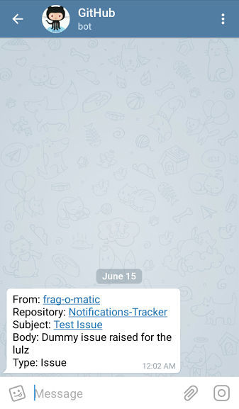

# Notifications Tracker
Forward GitHub notifications to Telegram.

Author: Arion Miles (Kanishk Singh)

# Introduction

Triton is a Telegram Bot which forwards my GitHub notifications. Named after [the Greek God](https://en.wikipedia.org/wiki/Triton_(mythology)), the messenger of the seas.

Uses [GitHub API v3](https://developer.github.com/v3/) to monitor for new notifications and then formats it, and forwards to your Telegram Messenger via a bot. Who constantly checks email, amirite? I'm always online on Telegram so I might as well have the notifications delivered there instead of using the default email method. Plus, it was a learning experience! Really, I don't have a better motive to explain why I made this.

I'm always trying to make Triton better. But nothing's perfect. I'm looking for a way to reduce polling times without hitting my API requests limit. Currently it checks for a notification every 2.5mins.

# Installation

You need three pieces of information: `Telegram BOT TOKEN`, `Telegram CHAT ID`, and `GitHub TOKEN`. [Start here](https://core.telegram.org/bots#3-how-do-i-create-a-bot) to learn how to create a Telegram Bot for **Bot Token**. You can message [@get_id](https://telegram.me/get_id_bot) bot with `/my_id` and it'll give you a 9-digit `Chat ID`. You can make a new Personal Access Token for GitHub [here.](https://github.com/settings/tokens/new) Put any description you want, and check `Notifications` in the scope options and click Generate. Keep this token safe, because you cannot retrieve it back if it's lost, only generate a new one.

#### Heroku:
Run `heroku config:set TOKEN=<Telegram-Bot-Token> CHAT_ID=<9-Digit Chat ID> GITTOKEN="token <Github-Personal-Access-Token>"`.

#### Local:
For running this locally, set environment variables `TOKEN`, `CHAT_ID`, and `GITTOKEN`.

On **Windows**, run: `set TOKEN=<Telegram-Bot-Token> & set CHAT_ID=<9-Digit Chat ID> & set GITTOKEN=token <Github-Personal-Access-Token>`

**Linux:** `export TOKEN=<Telegram-Bot-Token> && CHAT_ID=<9-Digit Chat ID> && GITTOKEN=token <Github-Personal-Access-Token>`

Add the tokens you received earlier. Remember to leave the `token` word in the `GITTOKEN` as it is because it is required in the headers by the API, or you'll get a `TypeError` because the program will never find any JSON output.

# To-Do
- [x] Add images
- [x] Edit/Fine Tune MessageContent. (add comment text, if possible)
- [x] Put a try-except block to catch any exceptions for debugging.
- [x] Change name to something better. (previously Notifications-Tracker)
- [ ] Add repo to https://gallery.devup.in/
- [ ] Add python3 compatibility

# Contributors
 - [oxalorg](https://github.com/oxalorg)

# License
MIT License. Please see [License](LICENSE.md) file for more information.
